<div align="center">

# Purchase Order Agent

**AI-powered purchase order intake and fulfillment pipeline**

Automatically processes incoming purchase order emails — classifies, extracts data via OCR + LLM,
validates, logs to Google Sheets, and replies to the sender.

[](https://python.org)
[](https://langchain-ai.github.io/langgraph/)
[](https://openai.com)
[](https://fastapi.tiangolo.com)
[](https://railway.app)
[](#testing)
[](#eval-scores)

</div>

---

## How It Works

```mermaid
flowchart LR
    subgraph Intake
        A["📧 Gmail"] -->|new email| B["Composio\nTrigger"]
        B -->|webhook POST| C["FastAPI\n/webhook/email"]
    end

    subgraph LangGraph Pipeline
        direction LR
        C -->|background task| D["🏷️ Classify"]
        D -->|valid PO| E["📄 Extract\nOCR + LLM"]
        D -->|not a PO| J
        E --> F["✅ Validate"]
        F --> G["📊 Track\nGoogle Sheets"]
        G --> H["📨 Notify\nSend reply"]
        H --> J["📋 Report"]
    end

    J --> K(("END"))

    style A fill:#4285F4,color:#fff,stroke:none
    style B fill:#FF6B35,color:#fff,stroke:none
    style C fill:#009688,color:#fff,stroke:none
    style D fill:#7C4DFF,color:#fff,stroke:none
    style E fill:#7C4DFF,color:#fff,stroke:none
    style F fill:#7C4DFF,color:#fff,stroke:none
    style G fill:#7C4DFF,color:#fff,stroke:none
    style H fill:#7C4DFF,color:#fff,stroke:none
    style J fill:#7C4DFF,color:#fff,stroke:none
    style K fill:#424242,color:#fff,stroke:none
```



> **Deterministic pipeline, not an autonomous agent.** LangGraph orchestrates a fixed sequence of nodes with one conditional branch after classification. The LLM generates content (classification, extraction, email text), but never decides which tools to call.

## Architecture


### Node Responsibilities

| Node | What it does | Inputs | Outputs |
|:-----|:-------------|:-------|:--------|
| **Classify** | Analyzes email subject + body + attachment presence | Email metadata | `is_valid_po`, `po_id`, `reason` |
| **Extract** | PDF → OCR text → LLM structured output with per-field confidence | PDF attachment | `PurchaseOrder` with 7 fields |
| **Validate** | Checks fields for `None`, empty strings, or low confidence | Extracted PO | `missing_fields` list |
| **Track** | Appends row to Google Sheets via Composio | Validated PO | Sheet row ID |
| **Notify** | LLM generates confirmation or missing-info email, sends via Gmail | PO + validation result | Sent email |
| **Report** | Consolidates final status | All prior state | `completed` / `missing_info` / `skipped` / `error` |

### Error Handling

Every node wraps its logic in `try/except`. On failure, it sets `error_message` in the workflow state. Downstream nodes check this guard and pass through. `ReportNode` consolidates the final status.

---

## Tech Stack

| Layer | Technology | Purpose |
|:------|:-----------|:--------|
| **Language** | Python 3.12 | Type hints, modern async |
| **Workflow** | LangGraph | Conditional routing, typed state, tracing |
| **LLM** | OpenAI `gpt-4o-mini` | Structured outputs via `client.beta.chat.completions.parse()` |
| **OCR** | Tesseract + pdf2image | Handles scanned and digital PDFs |
| **Integrations** | Composio | Managed OAuth for Gmail + Google Sheets |
| **API** | FastAPI | Async webhook with background tasks |
| **Observability** | Opik | Tracing + eval experiment tracking |
| **Models** | Pydantic v2 | Domain models, config, LLM response schemas |
| **Tests** | pytest | Unit + integration + eval framework |
| **Linting** | Ruff | Fast Python linting |
| **Packages** | uv | Fast dependency resolution |
| **Deploy** | Docker + Railway | Multi-stage build, auto-deploy from GitHub |

---

## Evaluation Framework

> The eval framework was the **first thing built** — before any node implementation. Graders and scenarios define "correct" before the code exists.

### Graders

| Grader | Type | Methodology |
|:-------|:-----|:------------|
| **ClassificationAccuracy** | Binary | `actual.is_valid_po == expected.is_valid_po` |
| **ExtractionAccuracy** | Field-level F1 | Compares 7 fields with whitespace + case normalization |
| **TrajectoryCorrectness** | Exact match | Actual vs expected ordered node list |
| **ValidationCorrectness** | Set F1 | Precision/recall on `missing_fields` detection |
| **EmailQuality** | Heuristic | Length, PO ID mention, confirmation language, customer mention |

### Scenario Categories

| Category | What it tests |
|:---------|:-------------|
| `happy_path` | Complete POs — full pipeline end-to-end |
| `not_a_po` | Non-PO emails — classify → report (skipped) |
| `missing_fields` | Incomplete POs — validation warnings |
| `malformed_pdf` | Corrupted/noisy PDFs — OCR resilience |
| `ambiguous` | Edge cases — multiple PO IDs, unclear addresses |

### Eval Scores

| Metric | Score | Target | Status |
|:-------|------:|:-------|:------:|
| ClassificationAccuracy | **1.00** | >= 0.95 | :white_check_mark: |
| ExtractionAccuracy | **0.97** | >= 0.85 | :white_check_mark: |
| TrajectoryCorrectness | **1.00** | >= 0.95 | :white_check_mark: |
| ValidationCorrectness | **1.00** | >= 0.85 | :white_check_mark: |
| EmailQuality | **1.00** | >= 0.70 | :white_check_mark: |

---

## Getting Started

### Prerequisites

- Python 3.12+
- [uv](https://docs.astral.sh/uv/) package manager
- Tesseract OCR + Poppler
- API keys: OpenAI, Composio, Opik (optional)

```bash
# macOS
brew install tesseract poppler

# Ubuntu/Debian
sudo apt install tesseract-ocr tesseract-ocr-eng poppler-utils
```

### Installation

```bash
# Clone and install
git clone https://github.com/your-username/purchase-order-agent.git
cd purchase-order-agent
uv sync

# Configure environment
cp .env.example .env
# Edit .env with your API keys
```

### Running

```bash
# Start the webhook server
uv run uvicorn src.api:app --reload

# Run with Docker
docker build -t po-agent .
docker run -p 8000:8000 --env-file .env po-agent
```

### Testing

```bash
# Unit tests (fast, no API keys needed)
uv run pytest tests/unit/

# Integration tests (requires OPENAI_API_KEY)
uv run pytest tests/integration/ -m integration

# All tests
uv run pytest tests/

# Linting
uv run ruff check src/ tests/ evals/
```

### Running Evals

```bash
# All scenarios
uv run python -m evals.run_eval --experiment-name "my-experiment"

# Single category
uv run python -m evals.run_eval --category happy_path

# Sync scenarios to Opik dashboard
uv run python -m evals.sync_dataset
```

---

## Environment Variables

| Variable | Required | Description |
|:---------|:--------:|:------------|
| `OPENAI_API_KEY` | Yes | OpenAI API key |
| `COMPOSIO_API_KEY` | Prod | Composio API key for Gmail + Sheets |
| `COMPOSIO_USER_ID` | — | Composio entity ID (default: `default`) |
| `COMPOSIO_WEBHOOK_SECRET` | — | Webhook HMAC signature verification |
| `SPREADSHEET_ID` | Prod | Google Sheets spreadsheet ID |
| `SHEET_NAME` | — | Sheet tab name (default: `Sheet1`) |
| `OPIK_API_KEY` | — | Opik cloud tracking |
| `OPIK_WORKSPACE` | — | Opik workspace name |
| `OPIK_PROJECT_NAME` | — | Opik project name |

---

## Project Structure

```
src/
├── api.py                    # FastAPI webhook + signature verification
├── config.py                 # AppConfig (Pydantic BaseSettings, YAML + env)
├── builder.py                # WorkflowBuilder (config-driven DI)
├── workflow.py               # LangGraph graph definition
├── core/                     # Domain models, state, LLM response schemas
│   ├── workflow_state.py     #   POWorkflowState (TypedDict)
│   ├── purchase_order.py     #   PurchaseOrder, ExtractionResult
│   ├── llm_responses.py      #   ClassificationResult, LLMExtractionResponse
│   └── webhook.py            #   ComposioWebhookPayload, parse_composio_webhook
├── nodes/                    # LangGraph nodes (BaseNode subclasses)
│   ├── base.py               #   BaseNode ABC
│   ├── classify.py           #   ClassifyNode
│   ├── extract.py            #   ExtractNode
│   ├── validate.py           #   ValidateNode
│   ├── track.py              #   TrackNode
│   ├── notify.py             #   NotifyNode
│   └── report.py             #   ReportNode
└── services/                 # ABC interfaces + implementations
    ├── llm/                  #   LLMService → OpenAILLM
    ├── ocr/                  #   OCRService → TesseractOCR
    ├── tools/                #   ToolManager → ComposioToolManager, MockToolManager
    └── prompt_store/         #   PromptStore → LocalPromptStore

evals/
├── run_eval.py               # Evaluation runner (Opik integration)
├── sync_dataset.py           # Sync scenarios to Opik dashboard
├── graders/                  # 5 metric graders
├── scenarios/                # JSON scenario files (5 categories)
└── fixtures/                 # PDF test fixtures per category

prompts/en/                   # YAML prompt templates
├── classify.yaml             #   Classification system + user prompts
├── extract.yaml              #   Extraction system + user prompts
└── notify.yaml               #   Notification templates

tests/
├── unit/                     # 215 tests — mocked, no API keys
└── integration/              # 15 tests — real LLM/OCR/API calls
```

---

## Design Decisions

<details>
<summary><b>Eval-first methodology</b> — why test before build?</summary>

Graders and scenarios were designed before node implementations. This inverts the usual "build then test" flow and ensures every component has measurable acceptance criteria from the start. When a node is implemented, it either passes the scenarios or it doesn't — there's no ambiguity about "done."
</details>

<details>
<summary><b>LangGraph over a simple pipeline</b> — isn't this overkill?</summary>

A plain function chain would work for the current linear flow, but LangGraph provides conditional routing (classify → skip or continue), typed state, built-in tracing, and a clear path to adding cycles (e.g., re-entry for missing fields) without rewriting the orchestration layer.
</details>

<details>
<summary><b>Tesseract over pdfplumber</b> — why not just extract text?</summary>

pdfplumber extracts text from digital PDFs but fails on scanned documents. Tesseract handles both, which is critical for real-world POs that are often scanned or photographed.
</details>

<details>
<summary><b>Composio direct execution over LLM tool calling</b></summary>

Nodes decide *what* to do (send email, append row); Composio executes it. This keeps the workflow deterministic — the LLM generates content, not decisions about which tools to call.
</details>

<details>
<summary><b>Structured outputs (native <code>parse()</code>) over Instructor</b></summary>

OpenAI's `beta.chat.completions.parse()` enforces the schema server-side via constrained decoding. No extra dependency, no client-side retry logic.
</details>

<details>
<summary><b>Async webhook with <code>BackgroundTasks</code></b></summary>

The full pipeline (OCR + LLM) takes 30+ seconds. Returning 202 immediately prevents Composio webhook timeouts, while `BackgroundTasks` processes the email asynchronously.
</details>

---

## Future Improvements

<details>
<summary><b>Scalability</b></summary>

- **Task queue** — Replace `BackgroundTasks` with Celery or Redis-backed queue (arq, dramatiq) for horizontal worker scaling and retry/dead-letter semantics
- **Stateful deduplication** — Redis or database-backed dedup store that survives restarts and works across instances
- **Multi-tenant routing** — Route webhooks by sender domain or Composio user ID with per-tenant config
- **Concurrent attachments** — Parallel OCR + extraction for emails with multiple PDFs
</details>

<details>
<summary><b>LLM-as-a-Judge evaluation</b></summary>

- **Opik G-Eval integration** — Replace heuristic email grader with LLM-based scoring on a continuous scale
- **Multi-dimensional scoring** — Separate scores for professionalism, completeness, actionability, accuracy
- **Hybrid approach** — Heuristic grader in CI (fast/cheap), LLM judge in scheduled evals (rich signal)
- **Beyond email** — Apply LLM judge to `classification_reason` quality and `extraction_warnings` helpfulness
</details>

---

<div align="center">
<sub>Built with an eval-first methodology — 215 unit tests, 15 integration tests, 25 eval scenarios, 5 graders.</sub>
</div>
